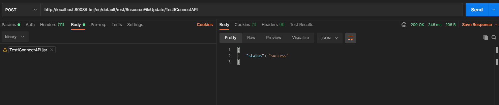
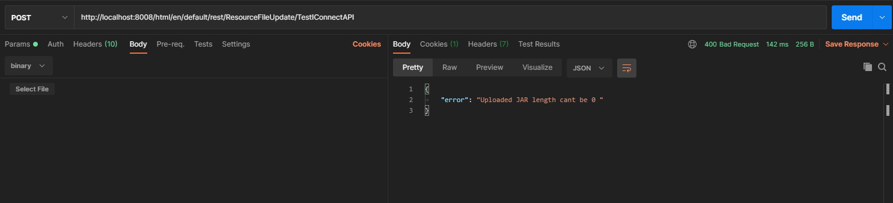
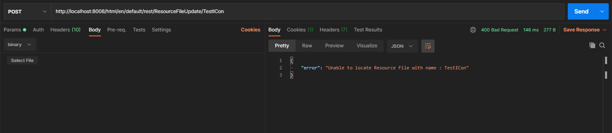

# IConnect API to Upload Resource File

This IConnect API helps the Developer to Upload the JAR file's to Resource BO in TRIRIGA.
The main Goal to Develop such kind of API is to save time of developer during develompent.

This API can be easily deployed to any OOB TRIRIGA System, without making much changes and is Ready for use.

# Prerequisites

-   Need to Create the ClassLoader & Resource with name **ResourceFileUpdate**.
-   Should have trirgaIntegration JAR for development (**NOT INCLUDED IN REPO**)

# One Time Setup

1)  Create ClassLoader with Name **ResourceFileUpdate**.
2)  Add JSON Jar as resource file (code dependency).
3)  Clone the Project and build JAR.
4)  Create new Resource File under the Newly Created Classloader & Upload the created JAR as Resource File.

# Usage

To invoke the API we need to make post call to the below URL.

`https://<env_url>:<port>/<context>/html/en/default/rest/ResourceFileUpdate/<resource_file_name>`

Here `<resource_file_name>` is the name of Resource File whose contents need to be updated.
The .jar file need to be sent as body of request.

# Validations

* If there is no file Attatched as Request for above API 400 Resoponse Code will be thrown with error
  

* If No Resource File is found with given name in API URL.

